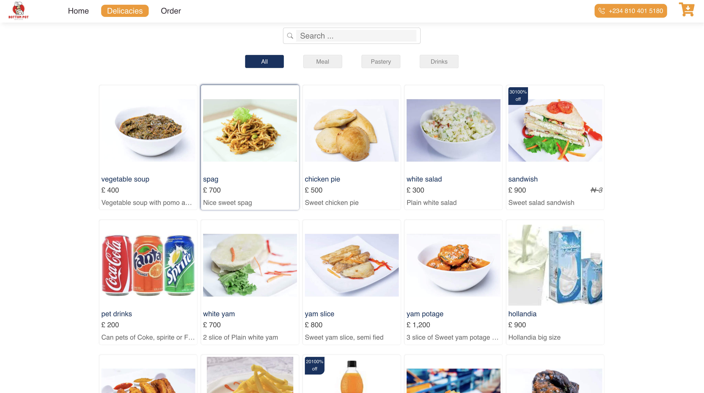

# Your One-Stop Shop for Delicious Food

[https://e-restaurant-app.vercel.app/products](https://e-restaurant-app.vercel.app/products)
## Overview

Welcome to  your ultimate destination for all things delicious. We offer a wide range of high-quality food items, carefully curated to satisfy your taste buds. Whether you're craving [Native foor], [Drinks], or [Pastries], we've got your cravings covered.

## About Us
 we are passionate about providing the best online food shopping experience. Our team is dedicated to selecting the finest ingredients and culinary delights to ensure your culinary adventures are memorable. We take pride in our commitment to customer satisfaction and culinary convenience.

## Key Features

- **Diverse Food Selection**: Explore a diverse menu of culinary delights.
- **User-Friendly Interface**: Enjoy a seamless and intuitive ordering experience with our easy-to-navigate website.
- **Secure Transactions**: Order with confidence, knowing that your payments and personal information are secure.
- **Prompt Delivery**: We offer quick and reliable delivery options to get your favorite dishes to your doorstep promptly.

## Chef's Dashboard

For our chefs and culinary experts, we provide a powerful and fully functional chef's dashboard:

- **Menu Management**: Easily manage your culinary creations, menu items, and dish details.
- **Order Management**: Stay in control of incoming orders, preparation, and delivery.
- **Financial Tracking**: Monitor and analyze your financial transactions, sales, and revenue with ease.

## Our Mission

Our mission is to make online food shopping and dining a delightful experience. We aim to provide:

- Uncompromised culinary quality and variety.
- Exceptional customer service and support.
- A convenient and secure dining experience.
- Timely delivery of your favorite dishes.

## Contact Us

Have questions or need assistance? Feel free to reach out to our friendly customer support team at [Your Contact Email]. We're here to assist you with any culinary inquiries, concerns, or feedback you may have.

## Explore [Your Food Store]

Ready to tantalize your taste buds? Visit [https://e-restaurant-app.vercel.app/products](https://e-restaurant-app.vercel.app/products) to explore our diverse menu of culinary delights and experience the convenience of our chef's dashboard. Thank you for choosing [Your Food Store], where your culinary satisfaction is our top priority.

Bon appétit!
